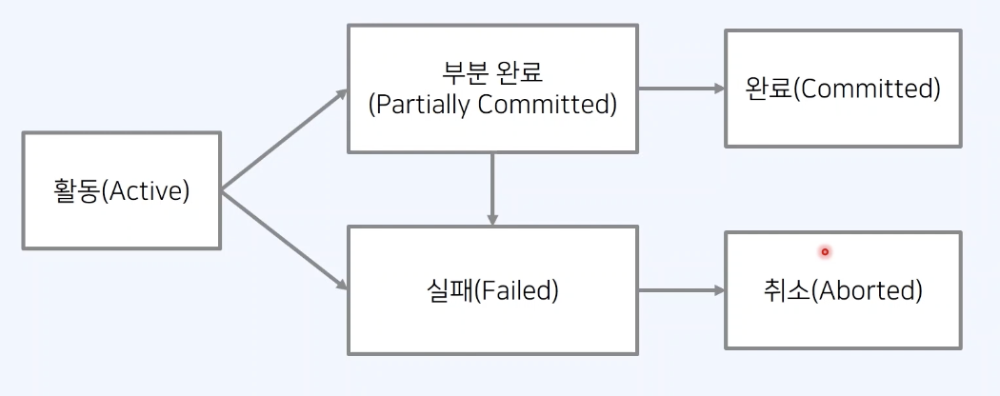

# 1️⃣ 웹(Web)

## 1. 웹 브라우저의 동작 방식

#### 🧷 다양한 웹 브라우저 Web Browser

* 웹 사이트에 접속할 때는 웹 브라우저 프로그램을 사용한다.
* 웹 브라우저의 기능
  * 웹 페이지를 서버에 요청 request하여 서버에 응답 response을 웹 문서 형태로 받기
  * 받은 웹 문서(HTML, CSS 등)을 렌더링 하여 모니터 화면에 웹 페이지를 표시
  *
    Chrome, Firefox, Safari

#### 🧷 서버(Server)와 클라이언트(Client)

* 클라이언트가 요청을 보내면, 서버가 응답한다.
* 서버와 클라이언트 구조의 대표적인 예시가 웹 서비스
* 클라이언트는 일종의 고객으로,
* 서버로 요청을 보낸 뒤에 응답이 도착할 때까지 기다린다.
*   서버로부터 응답을 받으면, 서버의 응답을 처리하여 화면에 출력한다.

    <figure><figcaption></figcaption></figure>
* 서버는 클라이언드로부터 받은 요청을 처리해 응답을 전송한다.
*   게임 서버, 모바일 서버, **웹 서버** 등

    <figure><figcaption></figcaption></figure>
* 서버가 클라이언트에게 어떠한 파일을 보내주는 것인가?

#### 🧷 HTML(Hypertext Markup Language)

* HTML은 웹 문서를 작성하기 위해 사용하는 프로그래밍 언어
* 마크업(Markup): 웹 문서가 모니터 화면에서 보이는 형태를 결정하는 구조
* HTML 문서: `<HTML>` 태그로 시작, `</HTML>` 태그로 종료

#### 🧷 HTTP(Hypertext Transfer Protocol)

* 하이퍼텍스트를 전송하기 위해 개발된 프로토콜로 간편히 데이터를 전송하게 해준다.
* 웹 브라우저의 주소 표시줄에 URL(Uniform Resource Locator)을 입력한 뒤에 접속을 시도한다.
* URL은 인터넷에 존재하는 특정한 정보 자원의 종류와 위치를 나타내는 문자열
* http(protocol)://dowellcomputer.com(인터넷 주소)

#### 🧷 웹 (Web)

* HTTP 프로토콜을 이용해 수없이 많은 페이지를 링크를 타고 이동
* 웹에서는 많은 페이지가 거미줄 같은 형태를 갖는다.

#### 🧷 웹  브라우저의 구조

<figure><figcaption></figcaption></figure>

#### 🧷 웹  브라우저의  동작 방식

* 웹 클라이언트는 웹 브라우저를 이용한다.
* 웹 브라우저에 주소를 입력하면 GET 방식으로 서버에 웹 문서를 요청한다.
* 웹 서버는 적절한 웹 문서를 찾아서 응답한다.
* 이후에 웹 브라우저는 문서를 화면에 표시한다.

1. 주소 입력 (http://www.gitbook.com) 후 엔터 (웹 클라이언트)
2. 웹 클라이언트가 웹 서버에 a.html 페이지 요청
3. 웹 서버는 a.html 해당 문서를 검색
4. a.html 페이지 응답
5. 웹 클라이언트가 a.html 화면 출력&#x20;

## 2. 쿠키(Cookie)와 세션(Session)

### 🔗 쿠키

* 사용자가 특정한 웹 사이트에 방문할 때, 사용자 컴퓨터에 저장하는 기록 파일
* 서버의 자원을 전혀 사용하지 않는다.
* 사용 예시: "아이디와 비밀번호를 저장하시겠습니까?"

### 🔗 세션

* 한 명의 사용자(브라우저)의 상태를 유지하는 기술
* 서버가 클라이언트에 고유한 Session ID를 부여하면, 클라이언트는 접속할 때마다 Session ID와 함께 요청
* 사용 예시: 웹 사이트에 한 번 로그인 하면, 다른 페이지로 이동해도 계속 접속 상태가 유지
* 만약 Session ID를 다른 클라이언트에게 탈취당하면, 다른 사람이 자신의 행세 가능

**세션 개요**

*
  서버에서 가지고 있는 객체로, 특정 사용자의 로그인 정보를 유지하기 위해 사용할 수 있다.
* 웹 사이트에 로그인 한 뒤, 서버에서는 세션 ID에 따른 회원 ID 정보를 기록한다.
* 클라이언트는 해당 세션을 계속 유지한다. (메일함에 접속할 때도 세션 ID를 서버에 전송한다.)
*   세션은 자신이 누구인지 서버에 알려주는 역할

    <figure><figcaption></figcaption></figure>

**세션 인증 방식 예시**

1. 로그인 페이지 요청
2. 로그인 페이지 응답
3. 로그인 요청 (ID, Password)
4. 세션 생성 및 유지
5. 세션 ID (Session) 응답
6. 브라우저에 세션 정보 저장
7. 세션 ID와 함께 요청(글쓰기 등) 수행
8. 세션 ID를 통해 회원 ID 접근
9. 해당하는 회원에 대하여 서비스(글쓰기 처리) 수행

<figure><figcaption></figcaption></figure>

**세션 방식의 특징**

⭐️ 장점

* 클라이언트에게는 세션 ID(회원 식별 목적)을 제공하고, 회원에 대한 중요한 정보를 서버가 가지고 있다.
* 민감한 데이터를 클라이언트에게 직접 보내지 않는다.
* 클라이언트 브라우저가 가지고 있는 세션 ID 자체에는 개인정보를 포함하고 있지 않다.

⭐️ 단점

* 악의적인 공격자가 세션 ID를 탈취하여 사용자인 척 위장할 수 있다.
* 웹 서버에 세션 정보를 기록하고 있어야 하므로, 접속자가 많을 때 서버에 메모리 부하가 존재할 수 있다.

## 3. HTTP

* HyperText Transfer Protocol, 웹상에서 데이터를 주고받기 위한 프로토콜
* 웹 문서를 주고받기 위하여 사용
* 웹, 모바일 앱, 게임

### 🔗 HTTP 메서드 (Method)

* 클라이언트는 요청(request)의 목적에 따라 적절한 HTTP 메서드를 사용

| HTTP 메서드 | 설명          | 사용 예시            |
| -------- | ----------- | ---------------- |
| GET      | 데이터 조회를 요청  | 특정 페이지 접속, 정보 검색 |
| POST     | 데이터 생성을요청   | 회원가입, 글쓰기        |
| PUT      | 데이터 수정을 요청  | 회원 정보 수정         |
| DELETE   | 데이터 삭제를 요청  | 회원 정보 삭제         |

**HTTP 메서드 사용 예시**

* 특정한 웹 사이트에 접속하면, 기본적으로 GET 방식으로 호출
* 상태 코드 (status code)를 이용해 본인의 요청에 대한 결과를 응답 받을 수 있다.
* 웹 사이트는 HTML, JavaScript, CSS 코드를 반환하여 웹 브라우저는 이를 화면에 출력한다.

### 🔗 HTTP 상태관리와 세션

* HTTP는 상태를 저장하지 않는다. Stateless
* 클라이언트는 HTTP로 서버에 연결한 뒤에, 응답을 받으면 연결을 끊어버린다.
  * 서버 입장에서 접속 유지에 대한 요구가 적어, 불특정 다수를 대상으로 하는 서비스에 적합
* 예시로, 상품확인 → 장바구니 → 결제의 과정이 시스템적으로 상태 정보로 기록되지 않는다.
* 하지만, 세션을 이용해 원하는 기능이 수행되도록 한다.

### 🔗 Keep Alive 기능

* 무상태성으로 인한 문제점을 위해 고안된 기능
* 하나의 웹 사이트에 방문하면 대게 수십 개의 파일(CSS, Image, HTML, JS)를 제공한다.
* TCP 통신 과정에서 연결 수행/연결 해제 과정에서 리소스가 많이 소요된다.
* keep-alive는 이런 파일을 하나씩 받기 위하여 매번 연결을 맺고 끊는 것을 방지한다.
* HTTP 1.1 버전부터 지원

