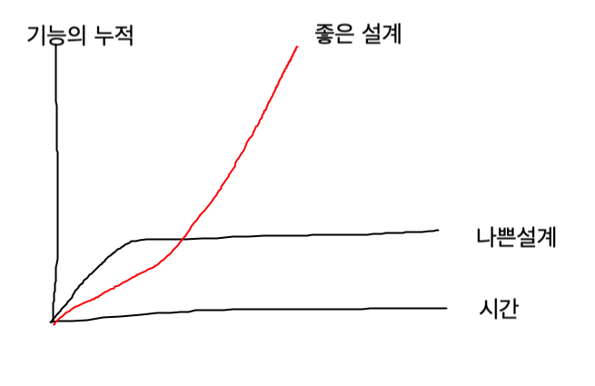

# 📎 아이템 16 number 인덱스 시그니처보다는 Array, 튜플, ArrayLike를 사용하기

자바스크립트는 이상하게 동작하기로 유명한 언어이다. 그중 가장 악명 높은 것은 암시적 타입 강제와 관련된 부분이다.

<figure><figcaption></figcaption></figure>

암시적 타입 강제와 관련된 문제는 대부분 === 와 !== 를 사용해서 해결이 가능하다.

## 📍 자바스크립트 객체

자바스크립트 객체 모델에도 이상한 부분들이 있으며, 이 중 일부는 타입스크립트 타입 시스템으로 모델링되기 때문에 자바스크립트 객체 모델을 이해하는 것이 중요하다.

**자바스크립트에서 객체란 키/값 쌍의 모음**이다. 키는 보통 문자열이고, 값은 어떤 것이든 될 수 있다.&#x20;

### 자바스크립트 객체 모델의 혼란

더 복잡한 객체를 키로 사용하려면 `toString` 메서드가 호출되어 객체가 문자열로 변환된다.

<figure><figcaption><p>'1, 2, 3' 이 문자열로 변환되었다.</p></figcaption></figure>

특히, 숫자는 키로 사용할 수 없다. 만약 속성 이름으로 숫자를 사용하려고 하면, 자바스크립트 런타임은 문자열로 변환한다.

<figure><figcaption><p>{ '1': 2, '3': 4}</p></figcaption></figure>

배열을 보자. 배열은 분명히 객체이므로 숫자 인덱스를 사용하는 것이 당연하다.

<figure><figcaption></figcaption></figure>

앞의 인덱스들은 문자열로 변환되어 사용된다. 문자열 키를 사용해도 배열의 요소에 접근할 수 있다.

<figure><figcaption></figcaption></figure>

Object.keys를 이용해 배열의 키를 나열해보면, 키가 문자열로 출력된다.

### 타입스크립트에서

타입스크립트는 이러한 혼란을 바로잡기 위해 숫자 키를 허용하고, 문자열 키와 다른 것으로 인식한다. `Array`에 대한 타입 선언에서 확인할 수 있다. (아이템6)

런타임에는 ECMAScript 표준이 서술하는 것처럼 문자열 키로 인식하므로 이 코드는 완전히 가상이지만, 타입 체크 시점에 오류를 잡을 수 있어 유용하다.

```typescript
const xs = [1, 2, 3];
const x0 = xs[0]; // OK
const x1 = xs['1']; // 인덱스 식이 'number' 형식이 아니므로 요소에 암시적으로 'any' 형식이 있다.

function get<T>(array: T[], k: string): T {
  return array[k];
    // 같은 오류
}
```

이 코드는 실제로 동작하지 않는다. 타입스크립트 타입 시스템의 다른 것들과 마찬가지로, 타입 정보는 런타임에서 제거된다.&#x20;

`Object.keys` 같은 구문은 여전히 문자열로 반환된다.

```typescript
const keys = Object.keys(xs); // 타입이 string[]
for (const key in xs) {
  key;  // 타입이 string
  const x = xs[key];  // 타입이 number
}
```

`string`이 `number`에 할당될 수 없기 때문에 마지막 두 줄이 동작하는 것이 이상하게 보일 것이다. 배열을 순회하는 코드 스타일에 대한 실용적인 허용이라고 생각하는 것이 좋다.

### 배열 순회 방법

자바스크립트에서는 흔한 예제이지만, 이 코드는 배열을 순회하기에 좋은 방법은 아니다. 인덱스에 신경 쓰지 않는다면 `for-of`를 사용하는게 더 좋다.

```typescript
for (const x of xs) {
  x; // 타입이 number
}
```

만약, 인덱스 타입이 중요하다면 `number` 타입을 제공해줄 `Array.prototype.forEach`를 사용하면 된다.

```typescript
xs.forEach((x, i) => {
  i;  // 타입이 number
  x;  // 타입이 number
});
```

루프 중간에 멈춰야 한다면 for(;;) 루프를 사용하는 것이 좋다.

```typescript
for (let i = 0; i < xs.length; i++) {
  const x = xs[i];
  if (x < 0) break;
}
```

타입이 불확실하다면 for-in 루프는 for-of 또는 for(;;) 루프에 비해 몇 배나 느리다.


### 배열에서는

인덱스 시그니처가 number로 표현되어있다면 입력한 값이 number여야 한다는 것을 의미하지만(for-in 루프는 확실히 제외), 실제 런타임에 사용되는 키는 string 타입이다.

일반적으로 string 대신 number를 타입의 인덱스 시그니처로 사용할 이유는 많지 않다. 만약 숫자를 사용하여 인덱스 항목을 지정한다면 Array 또는 튜플 타입을 대신 사용하게 될 것이다. number를 인덱스 타입으로 사용하면 숫자 속성이 어떤 특별한 의미를 지닌다는 오해가 생길 수 있다.

Array 타입이 사용하지도 않을 push나 concat 같은 속성을 가지는게 납득하기 어려울 수 있다. (구조적인 고려를 하고 있다는 뜻)

### ArrayLike

어떤 길이를 가지는 배열과 비슷한 형태의 튜플을 사용하고 싶다면 타입스크립트에 있는 ArrayLike 타입을 사용하자.

```typescript
function checkedAccess<T>(xs: ArrayLike<T>, i: number): T {
  if (i < xs.length) {
    return xs[i];
  }
  throw new Error(`배열의 끝을 지나서 ${i}를 접근하려고 했다.`)
} 
```

이 예제는 길이와 숫자 인덱스 시그니처만 있다. ArrayLike를 사용해도 키는 여전히 문자열이다.

```typescript
const tupleLike: ArrayLike<string> = {
  '0': 'A',
  '1': 'B',
  length: 2,
}; // OK
```

## 📍 요약

* 배열은 객체이므로 키는 숫자가 아니라 문자열이다. 인덱스 시그니처로 사용된 number 타입은 버그를 잡기 위한 순수 타입스크립트 코드이다.
* 인덱스 시그니처에 number를 사용하기보다 Array나 튜플, ArrayLike 타입을 사용하는 것이 좋다.
